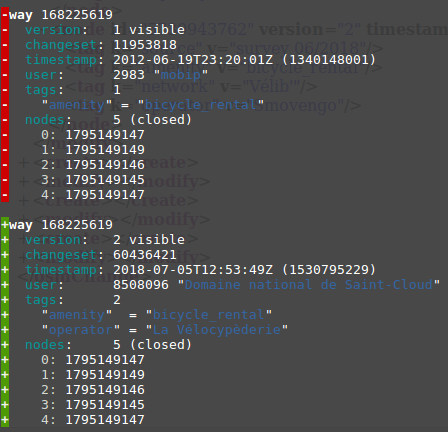
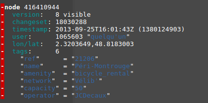
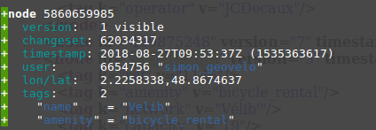

Getting detailed historical diff using osmium
===

## Initial config

* osmium version 1.7.1
* libosmium version 2.13.1

We will use the following [docker image](https://hub.docker.com/r/stefda/osmium-tool/) for osmium-tool, with a volume working directory (`wkd`) to store the data.

## Use case

The goal is to get a detailled diff of on bicycle_rental in Paris region between `2018-07-01T00:00:00Z` and `2018-09-01T00:00:00Z`.

Here is an almost equivalent augmented diff request :
```
[adiff:"2018-07-01T00:00:00Z",
       "2018-09-01T00:00:00Z"];
rel
  [admin_level=4]
  [name="Île-de-France"];
map_to_area->.a;
(
  node[amenity=bicycle_rental](area.a);
  way[amenity=bicycle_rental](area.a);
);
out meta geom;

```

Get all versions of all objects with the appropriate tags:

```shell
docker run -it -w /wkd -v $(pwd)/wkd:/wkd stefda/osmium-tool osmium tags-filter ile-de-france-internal.osh.pbf amenity=bicycle_rental -o out.osh.pbf

docker run -it -w /wkd -v $(pwd)/wkd:/wkd stefda/osmium-tool osmium getid --id-osm-file out.osh.pbf --with-history ile-de-france-internal.osh.pbf -o filtered.osh.pbf
```

Filter by start date and end date to only keep the period we are interested in:

```shell
docker run -it -w /wkd -v $(pwd)/wkd:/wkd stefda/osmium-tool osmium time-filter filtered.osh.pbf 2018-07-01T00:00:00Z -o result_2018-07-01.osm.pbf

docker run -it -w /wkd -v $(pwd)/wkd:/wkd stefda/osmium-tool osmium time-filter filtered.osh.pbf 2018-09-01T00:00:00Z -o result_2018-09-01.osm.pb
```

Make a diff between the two resulting datasets:

```shell
docker run -it -w /wkd -v $(pwd)/wkd:/wkd stefda/osmium-tool osmium diff result_2018-07-01.osm.pbf result_2018-09-01.osm.pbf -f debug,color -c
```
## Results

Here is a modified elem:



Here is a deleted one:



Here is an added one:



### Issues and limitations

**deteled items**:
there is no way to get the changeset that deletes an item using this methodology (and we need it to create an adiff file)

**changes on relations members**:
we need to check this use case, not sure we get the needed info on them

**output format**:
according to its maintainer, it is not possible to add the Augmented Diffs output format to libosmium: https://github.com/osmcode/osmium-tool/issues/147

NB: the `opl` diff format may be easier to parse :
```shell
docker run -it -w /wkd -v $(pwd)/wkd:/wkd stefda/osmium-tool osmium diff result_2018-07-01.osm.pbf result_2018-09-01.osm.pbf -f opl -c
```
